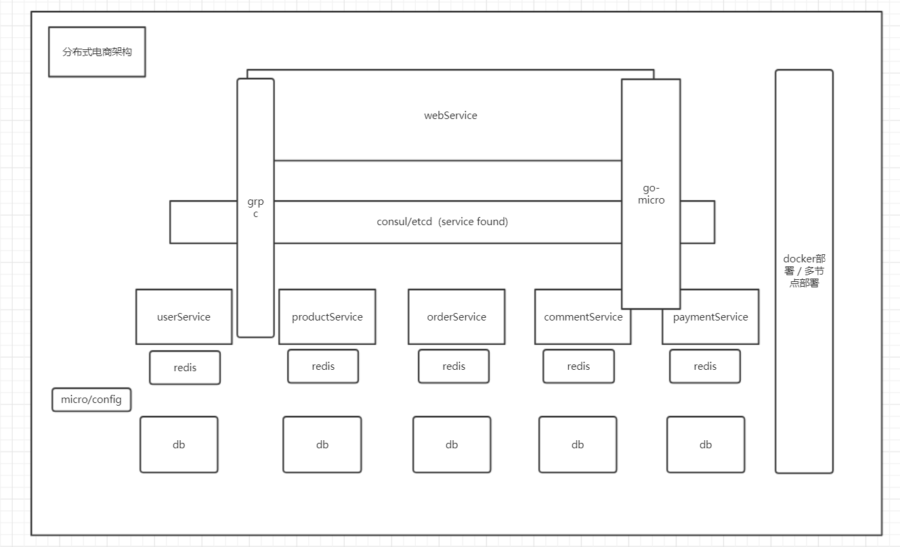

### 北邮we后端大作业：分布式架构电商项目

### 架构图

### 采用架构介绍：
* go-micro 微服务架构
* consul/etcd 服务发现，集成到micro中
* grpc 通讯框架，集成到micro中
* gorm 数据库操作
* redis 分布式缓存
* db 分布式数据库
* docker部署/多节点部署服务
* micro/config 配置管理

### 功能要求：
- [x] 用户账号服务：
    - [x] 用户注册
    - [x] 用户登录
    - [x] 用户退出
    - [x] 用户等级
- [x] 商品服务：
    - [x] 商品搜索（按名称、分类、标签等搜索筛选，按价格、购买次数、评价数量等进行排序）
    - [x] 商品维护（商品信息、商品分类、商品标签、商品价格、商品库存数量）
- [ ] 评价服务：
    - [x] 用户可以查看商品评价
    - [x] 可对购买的商品进行评价
- [ ] 订单服务：
    - [x] 创建订单（一个订单可包含多种商品）
    - [x] 订单查询
    - [x] 未支付订单撤销
- [ ] 支付服务：
    - [ ] 模拟调用一个支付网关，设定有一定比例的支付请求失败。

### 代码结构
* comment 评论服务
* order 订单服务
* payment 支付服务
* product 商品服务
* user 用户服务
* web web服务，负责前端页面展示，并与后端交互
* proto 协议文件，集中存放

### 服务启动方式

1. 启动consul 